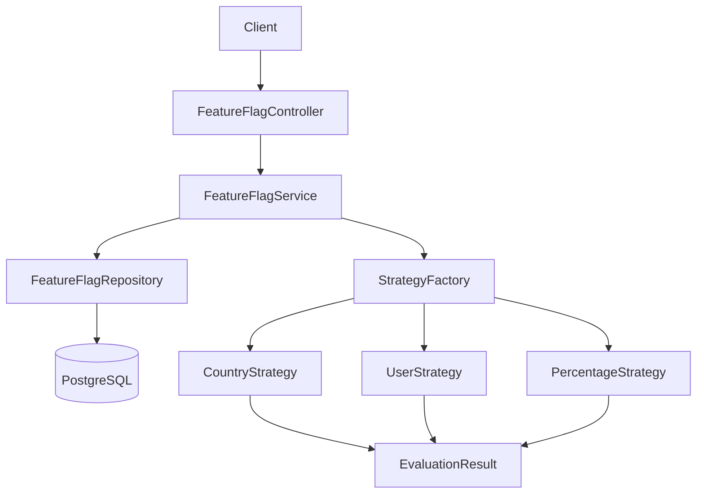

# Feature Flag Service

Production-oriented REST API to create, manage, and evaluate feature flags dynamically using user context.

## What This Service Does

- Creates and updates feature flags with a strategy and rules.
- Retrieves flag metadata by feature name.
- Evaluates if a flag is enabled for a specific context.
- Supports deterministic percentage rollout.
- Persists state in PostgreSQL with Flyway migrations.
- Uses clean layered architecture (controller -> service -> repository -> database).

## Tech Stack

- Java 21
- Spring Boot 3
- Spring Web
- Spring Data JPA
- PostgreSQL
- Flyway
- Bean Validation
- Lombok
- Caffeine (dependency added, cache layer pending final wiring)
- JUnit 5, Mockito, Spring Boot Test
- H2 (integration tests)
- GitHub Actions (single workflow: test -> deploy)

## Architecture



## Request Evaluation Flow

1. Client calls `POST /api/v1/flags/evaluate`.
2. Controller validates request DTO.
3. Service loads flag by `featureName`.
4. If flag is globally disabled, return `enabled=false`.
5. Service resolves strategy via factory (`COUNTRY`, `USER`, `PERCENTAGE`).
6. Strategy evaluates against `context` and returns boolean response.

## Project Structure

```text
src/main/java/com/example/feature/flag
  controller/
  service/
  repository/
  entity/
  dto/request/
  dto/response/
  mapper/
  strategy/
  exception/

src/main/resources
  application.yml
  application-prod.yml
  application-test.yml
  db/migration/V1__create_feature_flags_table.sql
```

## Configuration

The app imports values from `.env` (local) and activates profile-based config.

Required keys:

```env
APP_NAME=feature-flag
spring.profiles.active=prod
SERVER_PORT=8080

DB_HOST=...
DB_PORT=25060
DB_NAME=defaultdb
DB_USERNAME=...
DB_PASSWORD=...
DB_SSLMODE=require
```

## Local Run

### 1) Build and test

```bash
./mvnw clean verify
```

### 2) Run application

```bash
./mvnw spring-boot:run
```

### 3) Verify API

```bash
curl http://localhost:8080/v3/api-docs
```

## API Endpoints

### Create Feature Flag

- Method: `POST`
- Path: `/api/v1/flags`

Request:

```json
{
  "featureName": "NEW_CHECKOUT",
  "enabled": true,
  "strategy": "COUNTRY",
  "rules": {
    "country": "IN"
  }
}
```

Response: `201 Created`

### Update Feature Flag

- Method: `PUT`
- Path: `/api/v1/flags/{id}`

Request:

```json
{
  "featureName": "NEW_CHECKOUT",
  "enabled": false,
  "strategy": "COUNTRY",
  "rules": {
    "country": "IN"
  }
}
```

Response: `200 OK`

### Get Feature Flag

- Method: `GET`
- Path: `/api/v1/flags/{featureName}`

Response: `200 OK`

### Evaluate Feature Flag

- Method: `POST`
- Path: `/api/v1/flags/evaluate`

Request:

```json
{
  "featureName": "NEW_CHECKOUT",
  "context": {
    "country": "IN"
  }
}
```

Response:

```json
{
  "enabled": true
}
```

## Error Handling

Global exception handling returns structured JSON:

- `404` for missing feature
- `409` for duplicate feature
- `400` for invalid strategy or validation errors
- `500` for unhandled server errors

## Database

Table: `feature_flags`

- `id` (UUID, PK)
- `feature_name` (unique, varchar 100)
- `enabled` (boolean)
- `strategy` (varchar 30)
- `rules` (jsonb)
- `created_at`, `updated_at`

Flyway migration path:

- `src/main/resources/db/migration`

## Testing

Current suite includes:

- Service unit tests (business logic + strategy selection + edge cases)
- Controller tests (`@WebMvcTest`)
- Integration tests (`@SpringBootTest` + H2 + MockMvc)

Run tests:

```bash
./mvnw test
```

## CI/CD

Workflow file:

- `.github/workflows/cd.yml`

Pipeline order:

1. Test job (`mvn clean verify`)
2. Deploy job (on push to `main` only)

Deploy model currently used:

- Copy JAR to droplet
- Manage app as `systemd` service
- Health check after restart

Required GitHub secrets:

- `DROPLET_HOST`
- `DROPLET_USER`
- `DROPLET_PASSWORD`

## Notes

- Percentage rollout is supported using deterministic hashing on `userId`.
- Service is intentionally kept simple (KISS/YAGNI) with clear extension points for new strategies.
